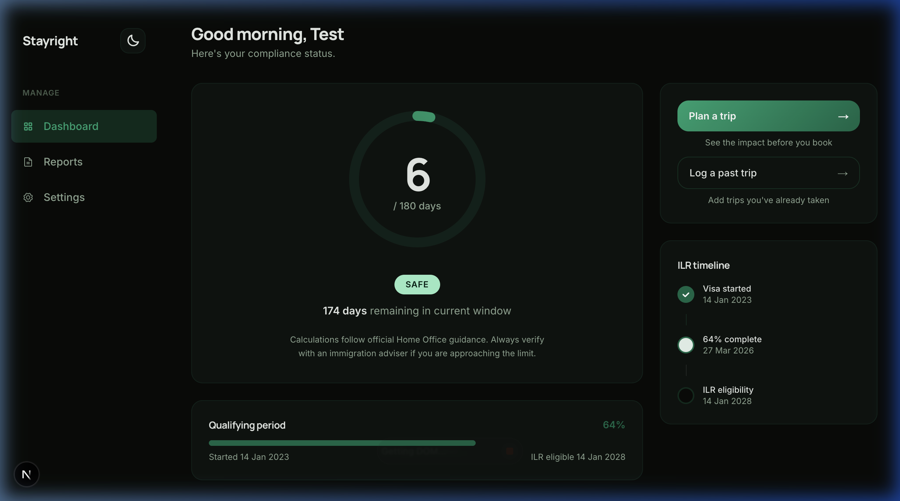
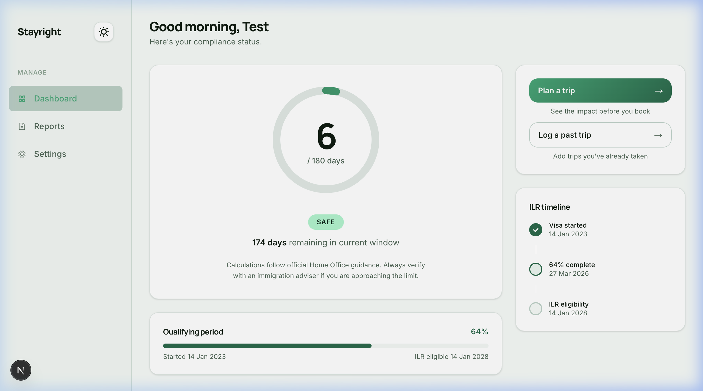
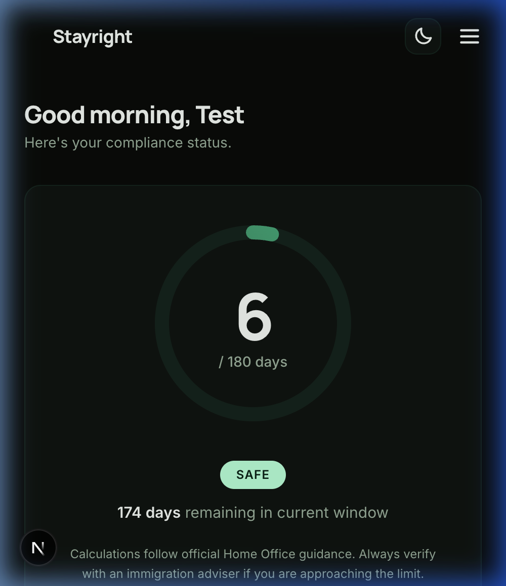

# StayRight 🇬🇧

StayRight is a premium, high-integrity visa absence tracker designed specifically for UK Skilled Worker visa holders. It eliminates the anxiety of permanent residency (ILR) applications by replacing manual spreadsheets with a live rolling-window calculator, audit-ready reports, and a "Dark Luxury" concierge experience.

**Live:** [stayright.vercel.app](https://stayright.vercel.app)

---

## 🎨 Visual Showcase

StayRight features an editorial-grade design system that adapts to your environment and device.







---

## ✨ Core Features

### 🚀 Intelligence & Compliance
- **Rolling Window Calculator**: Instantly see your 180-day absence quota across any rolling 12-month period.
- **ILR Timeline**: Visualize your journey from visa start to eligibility with a high-fidelity progress tracker.
- **Compliance Status**: Automatic "SAFE" or "WARNING" indicators based on official Home Office guidance.

### 📅 Streamlined Trip Management
- **Expandable Log**: Deep-dive into trip notes and edit records without losing your place.
- **Bulk Operations**: Manage large sets of travel data with multi-select deletion tools.
- **Zero-Friction UI**: Designed to prevent scroll-jumps and maintain context during heavy data entry.

### 🌓 Experience & Personalization
- **Theme Toggling**: Switch between **Light**, **Dark**, and **System** modes with a polished Sun/Moon switcher.
- **PWA Ready**: Install StayRight on your iPhone or Android for a native-app feel on the go.
- **Accessibility First**: WCAG 2.2 compliant navigation and screen-reader optimized components.

---

## 🛠 Tech Stack

| Layer | Technology |
|---|---|
| **Core** | Next.js 16 (App Router), TypeScript |
| **Styling** | Tailwind CSS v4, Vanilla CSS Tokens |
| **Backend** | Supabase (PostgreSQL, RLS, Auth) |
| **Themes** | `next-themes` (Class-based strategy) |
| **Testing** | Playwright E2E, Axe-core Accessibility |
| **Infrastructure** | Vercel, Stripe (Payments), Resend (Email), PostHog (Analytics) |

---

## 🚀 Running Locally

```bash
git clone https://github.com/bandicoutts/stayright.git
cd stayright
npm install
cp .env.local.example .env.local
# Fill in your Supabase, Stripe, and Resend credentials
npm run dev
```

Open [http://localhost:3000](http://localhost:3000) to see the platform in action.

---

## 📖 Documentation & Architecture

StayRight follows a strict decision-log architecture to ensure long-term maintainability.

- [**PRD.md**](docs/PRD.md): The single source of truth for feature specs and business logic.
- [**DECISIONS.md**](docs/DECISIONS.md): Architectural log documenting "why" over "what".
- [**DESIGN.md**](docs/DESIGN.md): Visual tokens and styling precedence rules.
- [**TESTING.md**](docs/TESTING.md): Strategy for ensuring 99.9% compliance accuracy.

---

## ⚖️ License & Disclaimer

*Disclaimer: StayRight provides calculations based on user input and Home Office guidance. It does not constitute legal advice. Always verify your eligibility with an immigration professional.*
